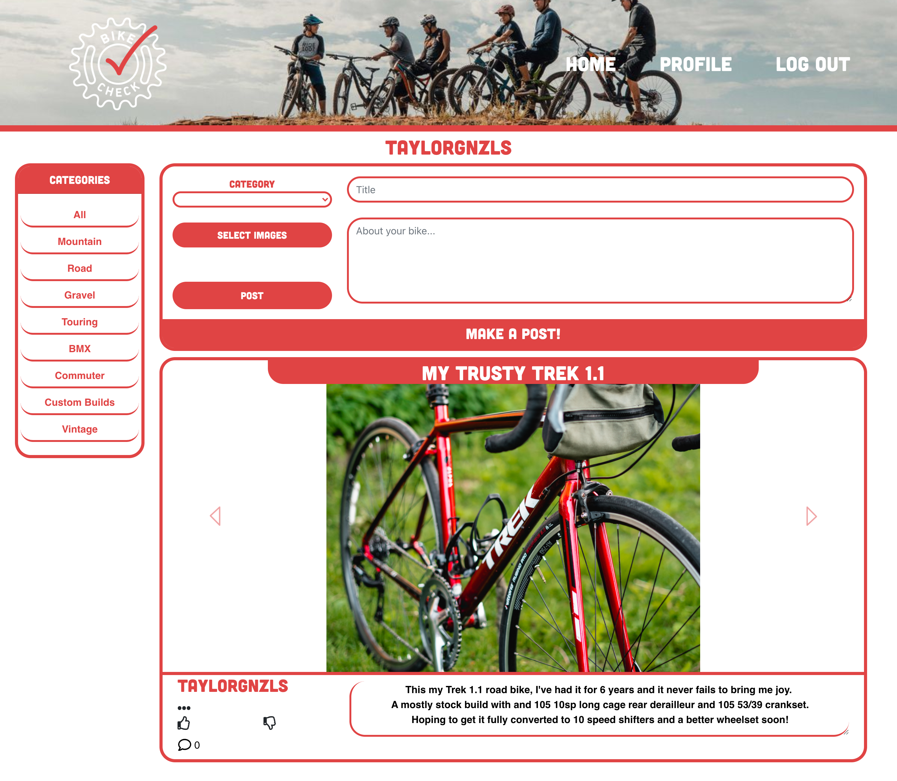

# Bike Check

---------------

## *Table of Contents*
- [Description](#description)
- [Installation](#installation)
- [Contributing](#contributing)
- [Author](#author)

---------------

## *Description*
This is a photo sharing social app for posting bike builds. Make post's with title, body, and multiple photo's

---------------

## *Installation*
npm install,
connect to your local mysql db
input auth0 connection
cloudinary input

---------------

## *Contributing*
Please use a new branch before contributing

---------------

## *Author*
Taylor Gonzales
Hanna Munoz
Tristan Laroche
Brendan Francis

---------------

This project is MIT licensed